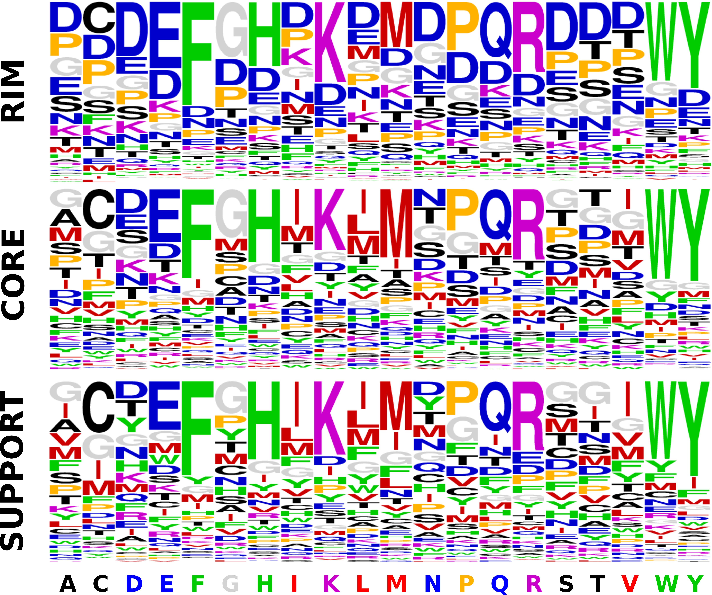

### Contents

- [Overview](#overview)
- [Requirements](#Requirements)
- [Tutorial](#Tutorial)
- [License](./LICENSE)

## Overview


Deep Local Analysis (DLA)-Mutation, contrasts the patterns observed in two small cubes encapsulating the physico-chemical and geometrical environments around the wild-type and the mutant amino acids. The underlying self-supervised model (ssDLA) takes advantage of a large-scale exploration of non-redundant available experimental protein complex structures in the Protein Data Bank (PDB) to learn the fundamental properties of protein-protein interfaces. Using evolutionary constraints and conformational heterogeneity improves the performance of DLA-Mutation.

#### Features:

- Useful APIs for fast estimation of changes in binding affinity due to single-point mutations based on a local comparison of atomic patterns found in pairs of cubes around a wild-type residue and its mutant. Beyond the predictive power on the effects of mutations, DLA is a general framework for transferring the knowledge gained from the available non-redundant set of complex protein structures to various tasks. For instance, given a single partially masked cube, it recovers the identity and physico-chemical class of the central residue. Given an ensemble of cubes representing an interface, it predicts the function of the complex. 

- Prediction of the changes of binding affinity based on Siamese architecture.

- Transfer the knowledge of protein-protein interfaces.

- Using structural and evolutionary information.

- Fast generation of cubes and evaluation of interface.

- Training and testing 3D-CNN models.

## Requirements

#### Packages:

DLA-Ranker can be run on Linux, MacOS, and Windows. We recommend to use DLA-Ranker on the machines with GPU. It requires following packages:
- [FreeSASA](https://github.com/mittinatten/freesasa) or [NACCESS](http://www.bioinf.manchester.ac.uk/naccess/)
- [ProDy](http://prody.csb.pitt.edu/) 
- lz4 compression tool
- Python version 3.7 or 3.8.
- Tensorflow version 2.2 or 2.3.
- Cuda-Toolkit
- Scikit-Learn, numpy pandas matplotlib lz4 and tqdm (conda install -c pytorch -c pyg -c conda-forge python=3.9 numpy pandas matplotlib tqdm pytorch pyg scikit-learn cuda-toolkit lz4).

All-in-one: Run conda create --name dla --file dla.yml

## Tutorial

### Representation learning with self-supervised Deep Local Analysis (ssDLA)
ssDLA is a structure-based general purpose model to generate informative representations from the local environments (masked or not-masked) around interfacial residues for downstream tasks.

#### Finding residue-specific patterns
Here we evaluate the pre-trained ssDLA models to predict the type of amino acid from the masked cube.

##### Generating masked locally oriented cubes
- Place the protein complexes in a directory (*e.g. 'Examples/complex_directory'*) like below. The 'complex_list.txt' is a csv file that contains three columns separated by ';': Name of target complex (`Comp`); receptor chain ID(s) (`ch1`), ligand chain ID(s) (`ch2`). 

```
Example
|___complex_list.txt
|
|___complex_directory
    |
    |___complex 1
    |___complex 2
    |
    ..........
```

- Specify the path to FreeSASA or NACCESS in ```lib/tools.py``` (```FREESASA_PATH``` or ```NACCESS_PATH```). The choice between FreeSASA or NACCESS can be specified in ```lib/tools.py``` (default is ```USE_FREESASA = True```).
- If you have 'Nvidia GPU' on your computer, or execute on 'Google COLAB', set ```FORCE_CPU = False``` in ```lib/tools.py```. Otherwise set ```FORCE_CPU = True``` (default is ```FORCE_CPU=False```).
- Specify the type of masking in ```Representation/python generate_cubes_interface.py```. You have the following options:
    - Masking a sphere of radius 5A randomly centered on an atom of the central residue. This is the default masking. The ssDLA model is trained by this masking procedure.
    - Masking a sphere of radius 3A randomly centered on an atom of the central residue. 
    - Masking only the side-chain the central residue.
    - Masking the whole central residue. 
    - No masking at all. 
    


- From ```Representation``` run ```python generate_cubes_interface.py```.

The output will be directory 'map_dir' with the following structure:

```
Example
|___map_dir
    |___complex 1
    |___complex 2
    ..........
```

Each output represents interface of a complex and contains a set of local environments (*e.g. atomic density map, structure classes (S,C,R), ...*)

An atomic density map is a 4 dimensional tensor: a voxelized 3D grid with a size of ```24*24*24```. Each voxel encodes some characteristics of the protein atoms. Namely, the first 167 dimensions correspond to the
atom types that can be found in amino acids (without the hydrogen). This dimension can be reduced to 4 element symbols (C,N,O,S) by running ```python generate_cubes_reduce_channels_multiproc.py``` (ATTENTION: This code overwrites the existing files).

##### Predicting the type of masked residue

From directory 'Evaluation' run ```python test_xray.py``` or ```python test_xray_4channels.py``` depending on the number of channels.

It processes all the target complexes and produces csv files 'output_xray_wt_mask' ('output_xray_wt_mask_4channels') as the output and 'intermediate_xray_wt_mask_200' ('intermediate_xray_wt_mask_200_4channels') as the embedding vectors. Each row of the output file belongs to an interfacial residue of a target complex and it has 10 columns separated by 'tab':

Name of the complex (`complex`) <br>
Residue name (`resname`) <br>
Structural region of the residue (`resregion`) <br>
Residue number (`resnumber`; according to PDB) <br>
Residue coordinate position (`respos`) <br>
Receptor or ligand (`partner`) <br>
The prediction vector of size 20 (`prediction`) <br>
The one-hot encoding of the target residue (`target`) <br>
Entropy of the prediction vector (`entropy`) <br>
Cross-entropy between the prediction vector and target vector (`crossentropy`) <br>

Each row of the embedding file also belongs to an interfacial residue. Beside the information mentioned above, it has the feature vectors of size 200 extracted from each cube.


<p align="center">
    
</p>

Similar analysis can be performed on backrub models by running ```python test_backrub.py``` or ```python test_backrub_4channels.py``` depending on the number of channels. 

### Downstream tasks

#### Predicting mutation-induced changes of binding affinity

- Place the wild-type and mutant complex backrub models in a directory (*e.g. 'Examples/backrub_directory'*) like below.

```
Example
|___backrub_directory
    |
    |___complex-mutation 1
    |   |   model 1
    |   |   model 2
    |   |   ...
    |
    |___complex-mutation 2
    |   |   model 1
    |   |   model 2
    |   |   ...
    |
    ..........
```

- From ```Representation``` run ```python generate_cubes_ddg.py```. It extracts cubic volumetric maps around the mutation positions from both wild-type and mutant complexes.

- From ```Test``` run ```python test_ddg.py```. The output contains the values of predicted and experimental values of $\Delta\Delta$G.

#### Predicting the physico-chemical class of interfacial residues

- Specify the non masking in ```Representation/generate_cubes_interface.py```.
- From ```Representation``` run ```python generate_cubes_interface.py```.
- From ```Evaluation``` run ```python test_xray.py``` or ```python test_xray_4channels.py``` (depending on the number of channels) to extract the embeddings.
- From ```Evaluation``` run ```python transfer_learning_aa_reducedalphabet.py``` or ```python transfer_learning_aa_reducedalphabet_xray.py``` to train a small neural network.

#### Predicting the function of the protein complex

- Specify the non masking in ```Representation/generate_cubes_interface.py```.
- From ```Representation``` run ```python generate_cubes_interface.py```.
- From ```Evaluation``` run ```python test_xray.py``` or ```python test_xray_4channels.py``` (depending on the number of channels) to extract the embeddings.
- From ```Evaluation``` run ```python transfer_learning_function.py``` to train a small neural network.

#### Acknowledgement
We would like to thank Dr. Sergei Grudinin and his team for helping us with the initial source code of ```maps_generator``` and ```load_data.py```. See [Ornate](https://academic.oup.com/bioinformatics/article/35/18/3313/5341430?login=true).


